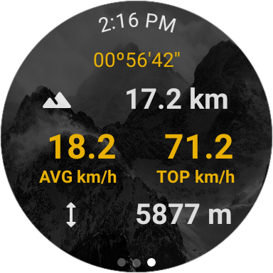

# ⌚️ Montblanc - Ski Tracking Feature - 2022
<i>MGT-555 - Innovation & entrepreneurship in engineering</i>

Android Smart-watch Ski-tracking app. Built using the latest Android libraries.

|  |  |
|:-----------------------:|:-----------------------:|
| Welcome Screen     | Current Run Stats     |

|  |  |
|:-----------------------:|:-----------------------:|
| Total Runs     | Total Stats     |

Stats tracked:
- Time skied
- Current speed
- Average speed
- Distance traveled
- Vertical distance traveled

---

## 📝 Table of Contents
- [⌚️ Montblanc - Ski Tracking Feature - 2022](#️-montblanc---ski-tracking-feature---2022)
  - [📝 Table of Contents](#-table-of-contents)
  - [💻 Links](#-links)
  - [🏛 Installation and Usage](#-installation-and-usage)
  - [Code organization](#code-organization)
  - [✍️ Author and Advisors](#️-author-and-advisors)

## 💻 Links
- <a href="https://developer.android.com/studio?gclid=Cj0KCQjwteOaBhDuARIsADBqRejGiRHy0a3ZSJ92Rs2zOCbQZUr9CVS1UY6qBSoiPj3i9AZIqBBpN5MaAnv8EALw_wcB&gclsrc=aw.ds">Android Studio</a>

## 🏛 Installation and Usage
- Download Android Studio
- Clone this repository
- Open this repository as a project folder in Android Studio
- Install Compose

## Code organization
- `app/src/main/java/com/github/michaelroust/montblanc_ski_tracking/presentation`:
    - `theme`: Contains UI Theme configuration for the whole app.
    - `utilities`: General utilities. Global constants and a Ticker implementation used to increment our app's timer.
    - `UIElements.kt`: Definitions of general UI elements reused throughout the app.
    - `MainActivity.kt`: Activity shown on app startup.
    - `StatsActivity.kt`: Activity containing all our ski tracking functionalities.
    - `SafetyAcvitiy.kt`: Only used for development and testing, unreachable in
      production app. Useful for quickly trying something out.

## ✍️ Author and Advisors
- Hugo Parent-Leduc (<a
                style="color: black;"
                href="mailto:hugo.parent-leduc@epfl.ch">hugo.parent-leduc@epfl.ch</a>)
- Camille Faugère-Béraud (<a
                style="color: black;"
                href="mailto:camille.faugere-beraud@epfl.ch">camille.faugere-beraud@epfl.ch</a>)
- Kutsal Topaloglu (<a
                style="color: black;"
                href="mailto:kutsal.topaloglu@epfl.ch">kutsal.topaloglu@epfl.ch</a>)
- Mattia Valitutti (<a
                style="color: black;"
                href="mailto:mattia.valitutti@epfl.ch">mattia.valitutti@epfl.ch</a>)
- Michael Roust (<a
                style="color: black;"
                href="mailto:michael.roust@epfl.ch">michael.roust@epfl.ch</a>)
- Olivier Staehli (<a
                style="color: black;"
                href="mailto:olivier.staehli@epfl.ch">olivier.staehli@epfl.ch</a>)
- Felix Obschonka (Montblanc)
- Michaud Véronique (EPFL)
- Weber Thomas Alois (EPFL)

Copyright (c) 2022 EPFL
this program is licensed under the terms of the [MIT].
